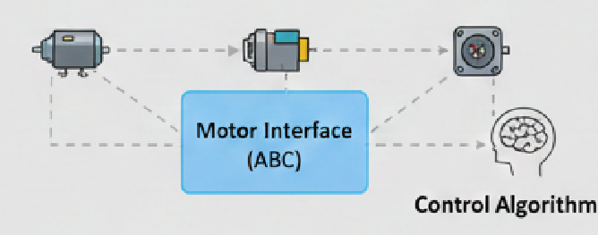
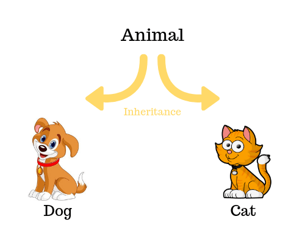
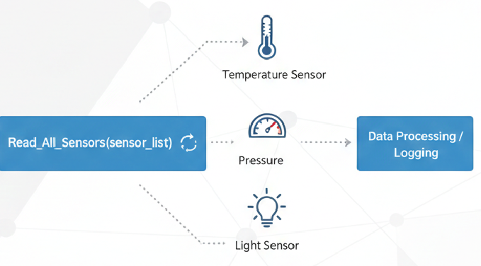
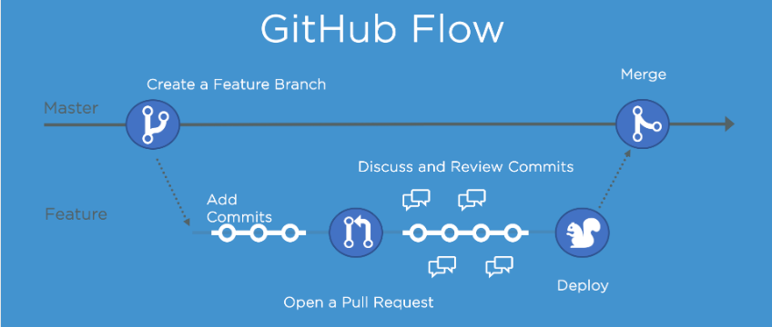

<style>
section::before {
  content: url('https://vgu.edu.vn/cms-vgu-theme-4/images/cms/vgu_logo.png'); /* Your logo URL */
  width: 20px; /* Adjust size */
  height: auto;
  position: absolute;
  right: 50px;
  top: 20px;
}
</style>

# Chapter 0: Introduction to Engineering Software for Mechatronic Systems

## Author: Tri Bien Minh | tri.bm@vgu.edu.vn | 


---
## Course Description 

This course introduces object-oriented programming (OOP) not merely as a syntax, but as a rigorous **Engineering Practice Focus** for controlling complex mechatronic systems. In an industrial environment, software is rarely written from scratch and never exists in isolation; therefore, this course simulates the **professional lifecycle of an engineer.**

### 1. From Scripting to System Architecture
Students transition from writing "disposable" scripts to developing **production-grade software**. The focus is on creating systems that are **Maintainable** and **Extensible**.

---

### 2. The Software-Hardware Contract
A central theme is the **Hardware Abstraction Layer (HAL)**. Engineers will learn to design "contracts" (interfaces) that decouple the high-level control logic from the specific electrical hardware. 

### 3. Professional Workflow and Tooling
To prepare for a career in robotics or embedded systems, students will operate within a **modern DevOps ecosystem**. This includes:

- **Version Control (Git):** Managing features via branches and disciplined commit history.
- **Automated Verification:** Shifting from "manual testing" to **Unit and Integration Testing** using `pytest`.
- **Code Quality:** Enforcing industry style guides and utilizing static analysis to catch bugs before they ever reach the physical hardware.

---

### 4. Deterministic Logic and Safety
Unlike web development, mechatronic software can cause physical harm. We emphasize **Automata-based design (FSMs)** to ensure the system is always in a known, deterministic state. Students will learn to model safety interlocks and error states as well as understand in their software architecture.

### 5. Transferability and Language Agnostic Design
While Python is the implementation tool, the **architectural patterns** (State Pattern, Dependency Injection, Observer Pattern) are taught with a view toward **C++ and ROS-based (Robot Operating System)** environments. This ensures that the mental models developed here are directly applicable to high-performance industrial control and autonomous systems.


---

## Course Learning Outcomes (CLOs)

By the end of the course, students will be able to:

1. Model technical systems using software variables and internal states
2. Implement automata-based (finite state machine) control systems
3. Design object-oriented architectures for sensors and actuators
4. Apply abstraction and polymorphism to achieve hardware-independent control
5. Use Python containers and algorithms professionally for data processing
6. Verify software using unit, module, and system-level tests
7. Use professional development tools such as Git, debuggers, build and test systems


---

## Books and References

- **Clean Code: A Handbook of Agile Software Craftsmanship** *Author:* Robert C. Martin  

- **Software Modeling and Design: UML, Use Cases, Patterns, and Software Architectures** *Author:* Hassan Gomaa  

- **Fluent Python: Clear, Concise, and Effective Programming** *Author:* Luciano Ramalho  

- **Robotics, Vision and Control: Fundamental Algorithms in Python** *Author:* Peter Corke
    *Focus:* The essential bridge between robotics theory (kinematics, dynamics) and Python implementation. Highly relevant for Chapters 7, 8 and 9.

---

### Supplemental Resources (Tools)

- **Python3 Tutorial** - [https://docs.python.org/3/tutorial/index.html](https://docs.python.org/3/tutorial/index.html)
- **Pro Git** (Scott Chacon and Ben Straub) – Available for free at [git-scm.com](https://git-scm.com/book/en/v2).
- **Official MuJoCo Documentation** – [https://mujoco.readthedocs.io/en/stable/overview.html](https://mujoco.readthedocs.io/en/stable/overview.html) For simulation and physics-based modeling.

---

## Chapter Learning Objectives

By the end of this chapter, you will:
- Understand the role of software in mechatronic systems
- Distinguish between scripting and control software
- Object-Oriented Programming (OOP)
- Compare procedural vs object-oriented programming paradigms
- Set up a professional development environment
- Initialize and manage a Git repository
- Organize a Python project structure


---

## Assessment Breakdown

- **Final project (code, tests, report): 20%**
- **Final WRITING exam: 80%**

---

## Academic Integrity Policy

- All submitted code must be explainable by the student
- Inability to explain submitted code may result in failure

- **AI tools may be used for conceptual explanation only.**
- **AI-generated code, logic, or architectural designs are not permitted unless explicitly stated.**
- **Students must be able to explain, derive, and modify all submitted code.**

---

## What is a Mechatronic System?

**Definition:** A system combining:
- **Mechanics** - Physical structures and components
- **Electronics** - Electrical hardware and controllers
- **Software** - Logic and decision making
- **Control** - Feedback loops and regulation

### Real-World Examples
- Industrial robotic arms
- Autonomous vehicles
- Medical devices
- Manufacturing equipment

---

## The Role of Software in Mechatronics

### Software Functions
1. **Sensing** - Process sensor data from the environment
2. **Decision Making** - Plan actions based on current state
3. **Control** - Execute commands to actuators
4. **Monitoring** - Verify system health and safety

### Why Software Matters
- Determines system behavior and capabilities
- Often determines product success/failure
- Must handle real-time constraints
- Needs to be maintainable and testable

---

## Scripting vs Control Software

### Scripting Software
**Purpose:** Automate repetitive tasks

- Simple, linear execution
- Direct user interaction
- High-level operations
- Example: Data processing scripts

```python
# Simple scripting example
for measurement in sensor_readings:
    print(measurement)
    save_to_file(measurement)
```

---

## Scripting vs Control Software (cont.)

### Control Software
**Purpose:** Manage real-time system behavior

- Reactive to environment changes
- Runs continuously (loops/events)
- Strict timing requirements
- Complex state management
- Safety critical

---
## Scripting vs Control Software (cont.)

### Control Software

```python
# Control software pattern
while system_running:
    sensor_data = read_sensors()
    decision = make_decision(sensor_data)
    execute_action(decision)
    check_safety_constraints()
```

---

## Procedural Programming

### Characteristics
- Functions are primary building blocks
- Code executed as sequence of procedures
- State shared via global variables
- Focus on **what** the code does

### Advantages
- Straightforward for simple programs
- Easy to understand execution flow
- Minimal overhead

---


## Procedural Programming
### Disadvantages
- Difficult to maintain as complexity grows
- State management becomes chaotic
- Code reuse is limited
- Testing is challenging

---

## Procedural Programming Example

```python
# Procedural approach
temperature = 0
sensor_error = False

def read_temperature():
    global temperature, sensor_error
    try:
        temperature = get_raw_value()
        sensor_error = False
    except:
        sensor_error = True
        temperature = -999

def check_temperature():
    if not sensor_error:
        if temperature > 100:
            trigger_alarm()

# Main loop
while True:
    read_temperature()
    check_temperature()
```
---
## Object-Oriented Example

```python
class TempSensor:
    def __init__(self, name="Main Sensor"):
        self.name = name
        self.temperature = 0
        self.has_error = False
    def read(self):
        try:
            self.temperature = get_raw_value()
            self.has_error = False
        except Exception:
            self.has_error = True
            self.temperature = -999
    def check_threshold(self, limit=100):
        if not self.has_error and self.temperature > limit:
            print(f"ALARM: {self.name} reached {self.temperature}°C")
            trigger_alarm()
sensor_a = TempSensor("Boiler 01")
sensor_a.read()
sensor_a.check_threshold()
```

---
## Procedural vs OOP: Summary

| Aspect | Procedural | Object-Oriented |
|--------|-----------|-----------------|
| **Organization** | Functions | Classes/Objects |
| **Data** | Global variables | Instance variables |
| **Reusability** | Limited | High (inheritance) |
| **Maintainability** | Low (complex) | High (modular) |
| **Scalability** | Difficult | Better |
| **Testing** | Harder (dependencies) | Easier (isolation) |

---

## Why Python in Programming Method 2 (After C++ in PM1)?

---

## Context

Students have already completed **Programming Method 1 (C++)**, including:

- Variables and data types  
- Control structures  
- Functions and classes  
- Compilation and memory concepts  

➡️ This course **does not replace C++**  
➡️ It **builds on that foundation**

---

## Programming Method 2 — Python

**Focus:**  
> *How engineers design control software systems*

- Software architecture and structure  
- Object-Oriented Programming (OOP)  
- State modeling (FSMs)  
- Algorithm clarity  
- System integration  
- Unit testing

---

## Why Python Is Used in This Course

Python is chosen to:

- Remove **accidental complexity**  
- Reduce syntactic overhead  
- Highlight **engineering design concepts**  
- Focus on **correctness, structure, and reasoning**  

> The goal is **better design**, not faster coding.

---

## Key Takeaway

- **C++** teaches you *how programs run*  
- **Python** teaches you *how systems are designed*  

A professional mechatronics engineer must master **both**.


---

## Object-Oriented Programming (OOP)

### Characteristics
- Objects encapsulate data and behavior
- Code organized around entities/concepts
- Encapsulation hides internal details
- Focus on **objects** and their interactions

### Core Principles
- **Abstraction** - Simplify complex systems, define what a component does
- **Encapsulation** - Hide complexity, protect how functions works internally
- **Inheritance** - Share common behavior
- **Polymorphism** - Flexible interfaces, use components interchangeably


---

## Abstraction — Simplifying Complex Systems
*Abstraction is the process of hiding implementation details and showing only the essential features of an object.*


<p align="center">
  
</p>


---
## Abstraction — Simplifying Complex Systems (cont)

```python
from abc import ABC, abstractmethod # ABC is Abstract Base Class in Python
class Motor(ABC):
    @abstractmethod
    def set_speed(self, rpm):
        """Every motor MUST implement this method"""
        pass
    @abstractmethod
    def stop(self):
        """Every motor MUST implement this method"""
        pass
```

The Motor abstract base class defines a *hardware-independent* interface for torque control. Allowing control algorithms to operate without knowledge of motor type, communication protocol, or simulation environment.

---

## Astraction Extended Example

```python
from abc import ABC, abstractmethod

# 2. CONCRETE IMPLEMENTATION A: Stepper Motor
class StepperMotor(Motor):
    def set_speed(self, rpm):
        # Hidden complexity: Step logic
        print(f">>> [Hardware Call] Pulsing GPIO pins for {rpm} RPM.")
        print(f"Stepper Motor: Moving at {rpm} RPM.")
        
    def stop(self):
        print("Stepper Motor: Engaging holding torque and stopping.")

# 3. CONCRETE IMPLEMENTATION B: DC Motor
class DCMotor(Motor):
    def set_speed(self, rpm):
        # Hidden complexity: PWM (Pulse Width Modulation) logic
        voltage = rpm * 0.01 
        print(f">>> [Hardware Call] Setting PWM Duty Cycle to {voltage}V.")
        print(f"DC Motor: Spinning at {rpm} RPM.")
        
    def stop(self):
        print("DC Motor: Shorting terminals for dynamic braking.")
```

---

## Astraction Print out result

```
--- Testing Stepper ---
>>> [Hardware Call] Pulsing GPIO pins for 1500 RPM.
Stepper Motor: Moving at 1500 RPM.
Stepper Motor: Engaging holding torque and stopping.

--- Testing DC Motor ---
>>> [Hardware Call] Setting PWM Duty Cycle to 30.0V.
DC Motor: Spinning at 3000 RPM.
DC Motor: Shorting terminals for dynamic braking.
```

---

## Encapsulation
*Encapsulation is the bundling of data (variables) and methods that operate on the data into a single unit, usually a class.*

<p align="center">
  
</p>

source: https://logicmojo.com/encapsulation-in-oops

---

## Encapsulation Example
Encapsulation bundles the data (name, __offset, __enable) and methods (enable, disable) together
```python
class Sensor:
    def __init__(self, name: str, offset: float = 0.5):
        self.name = name
        self.__offset = offset     # private calibration parameter
        self.__enabled = True      # private internal state

    def enable(self):
        self.__enabled = True

    def disable(self):
        self.__enabled = False

```

---

## Encapsulation Example (Check jupyter notebook)
```python
class Sensor:
    def __init__(self, name: str, offset: float = 0.5):
        self.name = name
        self.__offset = offset     # private calibration parameter
        self.__enabled = True      # private internal state

    def enable(self):
        self.__enabled = True

    def disable(self):
        self.__enabled = False

    def calibrate(self, new_offset: float):
        if not isinstance(new_offset, (int, float)):
            raise TypeError("Offset must be numeric")

        if abs(new_offset) > 10.0:
            raise ValueError("Calibration offset out of range")

        self.__offset = new_offset

    def get_calibrated_value(self, raw_value: float) -> float:
        if not self.__enabled:
            raise RuntimeError(f"Sensor {self.name} is disabled")
        return raw_value - self.__offset
```
---

## Inheritance 
*Inheritance is the mechanism of basing an object or class upon another object (prototype-based inheritance) or class (class-based inheritance), retaining similar implementation.*

<p align="center">
  
</p>

source: https://en.wikipedia.org/wiki/Inheritance_(object-oriented_programming)

---

## Inheritance Example

Inheritance allows a specific type of **Sensor** to "inherit" the properties of a general sensor without rewriting code.

```python

class UltrasonicSensor(Sensor):
    def __init__(self, name, pin):
        super().__init__(name) # Inherit from parent
        self.pin = pin

    def ping(self):
        return "Sending sonic pulse..."

dist_sensor = UltrasonicSensor("HC-SR04", 12)
print(dist_sensor.name) # Accessed from parent
print(dist_sensor.ping()) # Own unique method
```

---

## Polymorphism
*Polymorphism allows a value or variable to have more than one type and allows a given operation to be performed on values of more than one type.*


<p align="center">
  
</p>

source: https://en.wikipedia.org/wiki/Inheritance_(object-oriented_programming)


---


## Polymorphism Example (check Jupyter)

Polymorphism allows different objects to be treated the same way. In mechatronics, you might want to "read" all sensors in a loop, regardless of whether they are Temperature, Pressure, or Light sensors.

```python

class TemperatureSensor:
    def read(self):
        return "24°C"

class PressureSensor:
    def read(self):
        return "101.3 kPa"

# Polymorphism in action
sensors = [TemperatureSensor(), PressureSensor()]

for s in sensors:
    print(s.read()) # Same method name, different behaviors

```

---
## Why  Polymorphism Critical in Robotics

Without polymorphism ❌:
```
if sensor_type == "ultrasonic":
    read_ultrasonic()
elif sensor_type == "temperature":
    read_temperature()
```


With polymorphism ✅:
```
sensor.read()
```

---


## Object-Oriented Programming Example

```python
# Object-oriented approach
class TemperatureSensor:
    def __init__(self):
        self._value = 0
        self._error = False
    
    def read(self):
        try:
            self._value = self._get_raw_value()
            self._error = False
        except Exception as e:
            self._error = True
            self._value = -999
    
    def is_valid(self):
        return not self._error
    
    def get_value(self):
        return self._value if self.is_valid() else None

# Usage is cleaner and more intuitive
sensor = TemperatureSensor()
sensor.read()
if sensor.is_valid():
    print(sensor.get_value())
```

---

# Exercise 1: Encapsulation (The "Safe" Gripper)
**Task:** Create a simple class Gripper by writing. Do **NOT** need implement in the detail functions (just the name of functions and variables) (~10 line of code)

- Data: A private attribute __pressure (default 0) and __max_pressure (default 100).

- Method ``apply_pressure(amount)``: Should only update ``__pressure`` if the amount is between ``0`` and ``__max_pressure``. If it's higher, print an error ``"Safety Limit Exceeded!"``.

- Method ``get_status()``: Return the current pressure.

---

# Exercise 2: Inheritance (Actuator Types)

Goal: Use a base class to share properties between different hardware components. Do **NOT** need implement in the detail functions (just the name of functions and variables) (~10 line of code) 
Task: 
-  Create a base class ``Actuator`` with an ``__init__`` that takes a ``pin_number``. 
-  Create a subclass LED that adds a method ``turn_on()`` (prints "LED on pin X is glowing"). 
- Create a subclass ``Buzzer`` that adds a method ``beep()`` (prints "Buzzer on pin X is making sound").

---


## Apply Pseudocode Before Coding in Python
### What is Pseudocode
Pseudocode is a **human-readable way** to describe the steps of an algorithm using programming-like structures (assignments, conditions, loops) **without strict syntax**.
https://en.wikipedia.org/wiki/Pseudocode

---


## Pseudocode Cheat Sheet (Main Syntax)
<div style="display: flex; gap: 16px;">

<div style="flex: 1;">

**Start/End Program**
```
BEGIN PROGRAM
SET x ← value
READ input
PRINT output
END PROGRAM
```
**Conditional**
```
IF condition THEN
action
ELSE
action
END IF
```

</div >

<div style="flex: 1;">

**Comparison Operators**
```
= ≠ < ≤ > ≥
```
**Loop**

```
WHILE condition DO
action
END WHILE

FOR i ← start TO end DO
action
END FOR

REPEAT
action
UNTIL condition
```
</div>

<div style="flex: 1;">

**Case Selection**

```
CASE variable OF
value1: action
value2: action
DEFAULT: action
END CASE
```

**Function**
```
FUNCTION name(parameters)
statements
RETURN value
END FUNCTION

```


---

### How We Apply Pseudocode Before Coding in Python
- **Step 1 — Understand the Problem**

    - Example problem:

        ```
        Read a temperature sensor and convert °C to °F with F = (C × 9/5) + 32
        Ask:
        What inputs exist?
        What outputs are required?
        What rules or formulas apply?
        ```

- **Step 2 — Identify Data and States**
    
        INPUT: temperature in Celsius
        OUTPUT: temperature in Fahrenheit
        #Variables
        temperature_c
        temperature_f

---
### How We Apply Pseudocode Before Coding in Python (cont.)
- **Step 3 — Write the Pseudocode**

        BEGIN PROGRAM


            FUNCTION celsius_to_fahrenheit with temperature_c

            READ temperature sensor → temperature_c
            
            temperature_f ← celsius_to_fahrenheit(temperature_c)

            PRINT temperature_c and temperature_f

        END PROGRAM

        
---

# Full Pseudocode of logging simple sensor
```
BEGIN PROGRAM

    FUNCTION celsius_to_fahrenheit(temp_c)
        RETURN (temp_c × 9 / 5) + 32
    END FUNCTION


    READ temperature sensor → temperature_c

    temperature_f ← celsius_to_fahrenheit(temperature_c)

    PRINT "Temperature:"
    PRINT temperature_c + " °C"
    PRINT temperature_f + " °F"

END PROGRAM
```

---

# Exercise 4: The Smart Cooling Fan

Scenario: An engineer needs to design a cooling system. If the temperature exceeds 40°C, the fan must turn on. If it's below 40°C, the fan stays off.
Task A: Write the Pseudocode
Task B: Convert to OOP Python
# Exercise 5: Automated Drill Cycle

Scenario: A robotic drill must lower into a part, spin for 3 seconds, and then retract. This happens 5 times for a 5-hole pattern.
Task A: Write the Pseudocode
Task B: Convert to OOP Python

---

## Lab 1: Development Environment Setup

### Requirements
1. Python 3.8+ interpreter
2. A code editor (VS Code, PyCharm)
3. Git version control
4. Project directory structure

### Installation Steps
1. Download Python from python.org
2. Install IDE of choice
3. Install Git: https://git-scm.com/
4. Verify installations with version commands

---

## Verification Commands

```bash
# Check Python installation
python --version
# Output: Python 3.10.0 (or newer)

# Check Git installation
git --version
# Output: git version 2.34.1 (or newer)

# Create test directory
mkdir mechatronics-lab-0
cd mechatronics-lab-0
```

---
# How git command works

<div style="text-align: center;">


</div>

---
# git work flow

<div style="text-align: center;">



</div>


---

## Lab 2: Git Repository Initialization

### Initialize Repository
```bash
# Navigate to project directory
cd mechatronics-lab-0

# Initialize git repository
git init

# Configure git (one time setup)
git config user.name "Your Name"
git config user.email "your.email@example.com"

# Verify configuration
git config --list
```

---

## Understanding Git Basics

### Key Concepts
- **Repository** - Local copy of project with history
- **Commit** - Snapshot of changes with message
- **Branch** - Independent line of development
- **Remote** - Shared repository (GitHub, GitLab)

### Common Workflow
```bash
git add <files>              # Stage changes
git commit -m "message"      # Save changes locally
git push origin main         # Upload to remote
git pull origin main         # Download updates
```

---

## Lab 3: Python Project Structure

### Recommended Organization
```
mechatronics-lab-0/
├── .git/                 # Git metadata
├── .gitignore            # Files to ignore
├── README.md             # Project description
├── requirements.txt      # Dependencies
├── src/                  # Source code
│   ├── __init__.py
│   ├── main.py
│   └── sensors.py
├── tests/                # Test files
│   ├── __init__.py
│   └── test_sensors.py
└── docs/                 # Documentation
```

---

## Project Structure Details

### `.gitignore` - Essential Entries
```
# Python
__pycache__/
*.pyc
*.pyo
*.egg-info/
.pytest_cache/
# IDE
.vscode/
.idea/
# Environment
venv/
env/
.env
# OS
.DS_Store
Thumbs.db
```

---

## Python Package Structure

### `__init__.py` - Makes package importable
```python
# src/__init__.py
"""
Mechatronic Systems Control Package
Version 1.0
"""

__version__ = "1.0.0"
__author__ = "Your Name"

# Expose main classes/functions
from .sensors import TemperatureSensor
from .controllers import MotorController

__all__ = ['TemperatureSensor', 'MotorController']
```

---

## Project Requirements File

### `requirements.txt`
```
# Core dependencies
numpy>=1.19.0
scipy>=1.5.0

```
### Installation
```bash
pip install -r requirements.txt
```

---

## Best Practices for Mechatronic Software

### Code Quality
1. **Clear Names** - Use intention-revealing names
2. **Small Functions** - Single responsibility principle
3. **Comments** - Explain why, not what
4. **Testing** - Write tests before code (TDD)
5. **Documentation** - Document interfaces and APIs

---
## Best Practices for Mechatronic Software (Cont.)
### Version Control
1. Commit frequently with clear messages
2. One feature per branch
3. Review code before merging
4. Tag releases with version numbers

---

## Clean Code Principles

### For Mechatronic Systems
- **Reliability** - Code must work under stress
- **Readability** - Future maintainers will thank you
- **Testability** - Facilitate automated testing
- **Safety** - Handle edge cases and failures
- **Performance** - Real-time constraints matter

### The Boy Scout Rule
> "Leave the code a little cleaner than you found it"

---

## Deliverable Checklist

### Lab Deliverables
- [ ] Development environment installed (Python, Git, IDE)
- [ ] Verified all tools with version commands
- [ ] Git repository initialized with proper configuration
- [ ] `.gitignore` file created
- [ ] Project directory structure created
- [ ] README.md written with project description
- [ ] `requirements.txt` with dependencies listed
- [ ] `src/__init__.py` and main module structure

---

## Deliverable Verification

### Test Your Setup
```bash
# Test Python
python -c "print('Python works!')"

# Test Git
git status
git log --oneline

# Test project import
cd ..
python -c "from mechatronic_project import TemperatureSensor"

# Create first commit
git add .
git commit -m "Initial project setup"
git log --oneline
```

---

## Summary

### Key Takeaways
1. Mechatronic systems require careful software architecture
2. Scripting and control software serve different purposes
3. OOP provides better structure for complex systems
4. Professional development practices matter
5. Version control and testing are essential
6. Clean code principles improve maintainability

### Remember
> *"Any fool can write code that a computer can understand. Good programmers write code that humans can understand."* - Martin Fowler

---

## Questions & Discussion

**Topics for Lab Session:**
- Installation troubleshooting
- Git workflow questions
- Python project organization tips
- Development environment preferences

**Resources:**
- Python docs: https://docs.python.org/3/
- Git tutorial: https://git-scm.com/docs
- GitHub: https://github.com
- Stack Overflow: https://stackoverflow.com

---

## Appendix: Useful Commands Reference

### Git Commands
```bash
git init                      # Initialize repo
git clone <url>              # Clone existing repo
git add <file>               # Stage changes
git commit -m "msg"          # Commit changes
git push origin main         # Push to remote
git pull origin main         # Pull from remote
git branch <name>            # Create branch
git checkout <branch>        # Switch branch
git status                   # Check repo status
git log --oneline            # View history
```
---

### Python Commands
```bash
python --version             # Check version
python <file>.py             # Run script
python -m pytest             # Run tests
python -m pip install <pkg>  # Install package
python -c "code"             # Run inline code
python -m venv venv          # Create virtual env
source venv/bin/activate     # Activate venv
```

---

## Appendix: Setup Troubleshooting

### Issue: Python not found
**Solution:** Add Python to PATH environment variable

### Issue: Git commits show wrong author
**Solution:** Set global git config
```bash
git config --global user.name "Your Name"
git config --global user.email "your.email@example.com"
```

### Issue: Import errors
**Solution:** Ensure `__init__.py` exists in package directories

---
## Recommended Reading
- **Clean Code: A Handbook of Agile Software Craftsmanship** Robert C. Martin  

- **Software Modeling and Design: UML, Use Cases, Patterns, and Software Architectures** Hassan Gomaa  

- **Fluent Python: Clear, Concise, and Effective Programming** Luciano Ramalho  

- **Robotics, Vision and Control: Fundamental Algorithms in Python** Peter Corke

### Online
- Real Python: https://realpython.com
- Python official docs: https://docs.python.org
- GitHub Learning: https://github.com/skills
