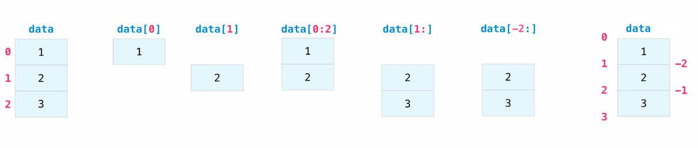

# Chapter 1. Basic Python Programming
## For Mechatronic Systems Development

## Author: Tri Bien Minh | tri.bm@vgu.edu.vn | 

---

## Python as a Language

- High-level, interpreted, dynamically typed
- Supports multiple paradigms:
  - Procedural (step-by-step instructions)
  - Object-oriented (classes and objects)
  - Functional (functions as first-class objects)
- **Batteries included:** rich standard library
- Industry standard for robotics (ROS/ROS2, simulation, data science)
- Readable syntax that encourages clean code

---

## Why Python for Mechatronics?

### Advantages
- Fast prototyping and iteration
- Extensive libraries: NumPy, SciPy, matplotlib
- ROS (Robot Operating System) native support
- Easy to learn but powerful
- Huge community and resources

### Limitations
- Slower than C/C++ for real-time
- But: Good enough for most control loops (100 Hz+)
- Use C/C++ for ultra-low-latency hardware drivers

---

## Running Python Code

### Interactive REPL (Read-Eval-Print Loop)

Great for experimentation and quick testing:

```bash
$ python3
Python 3.10.0 (main, ...)
>>>
```

Type code, press Enter, see results immediately.

### Script Mode

Write code in a file, run it from command line:

```bash
$ cat hello.py
print("Hello, world!")
$ python3 hello.py
Hello, world!
```

---

## Variables and Basic Types

- **No type declaration needed** – Python infers types
- Variables are names that bind to objects
- Common built-in types: `int`, `float`, `str`, `bool`, `list`, `dict`, `tuple`, `set`

```python
# Numeric types
answer = 42                    # int
temperature = 36.5             # float
pi = 3.14159                   # float

# String type
greeting = "Hello, Python!"    # str
name = 'Alice'                 # str (single or double quotes)

# Boolean type
is_active = True               # bool
is_error = False               # bool
```

---

## Type Hints (Optional but Recommended)

- Help document code and catch bugs
- Not enforced at runtime, but IDEs use them
- Increasingly important in professional code

```python
# Without type hints
def celsius_to_fahrenheit(c):
    return c * 9/5 + 32

# With type hints (clearer intent)
def celsius_to_fahrenheit(c: float) -> float:
    """Convert Celsius to Fahrenheit."""
    return c * 9/5 + 32

result: float = celsius_to_fahrenheit(25.0)
```

---

## Arithmetic Operators

```python
x = 10
y = 3

print(x + y)      # 13    (addition)
print(x - y)      # 7     (subtraction)
print(x * y)      # 30    (multiplication)
print(x / y)      # 3.333... (true division)
print(x // y)     # 3     (floor division)
print(x % y)      # 1     (modulo / remainder)
print(x ** y)     # 1000  (exponentiation)

# Common operations
radius = 5.0
area = 3.14159 * radius ** 2  # πr²
print(f"Area: {area:.2f}")     # Area: 78.54
```

---

## Comparison Operators

```python
a = 10
b = 5

print(a == b)    # False (equal)
print(a != b)    # True  (not equal)
print(a < b)     # False (less than)
print(a <= b)    # False (less than or equal)
print(a > b)     # True  (greater than)
print(a >= b)    # True  (greater than or equal)

# Chaining comparisons
temp = 25.0
print(0.0 <= temp <= 100.0)  # True
```

---

## Logical Operators

```python
# and, or, not
is_running = True
is_safe = False

print(is_running and is_safe)   # False (both must be True)
print(is_running or is_safe)    # True  (at least one True)
print(not is_safe)              # True  (negation)

# Common pattern: bounds checking
voltage = 12.0
if 0.0 <= voltage <= 24.0:
    print("Voltage in safe range")
```

---

## Strings: Basics

- Immutable sequences of characters
- Support indexing, slicing, and many methods

```python
name = "Python"

# Indexing (0-based)
print(name[0])       # 'P'
print(name[-1])      # 'n' (last character)
# Slicing (start:end, end is exclusive)
print(name[0:3])     # 'Pyt'
print(name[1:4])     # 'yth'
print(name[::2])     # 'Pto' (every 2nd character)
# Length
print(len(name))     # 6
# Membership
print('y' in name)   # True
```


---

## Exercise 1.1 Logging simple sensor

Please write Pseudocode of this logging simple sensor
We have:
- A temperature sensor (°C)
- A voltage sensor (V)
- A simple safety check

The program:
1. Reads sensor values
2. Converts units
3. Checks safe operating ranges
4. Prints formatted status messages


---

## Strings: Methods and Formatting

```python
text = "  hello world  "

# String methods (return new string)
print(text.strip())      # "hello world"
print(text.upper())      # "  HELLO WORLD  "
print(text.lower())      # "  hello world  "
print(text.replace("world", "python"))  # "  hello python  "
print(text.split())      # ["hello", "world"]

# String formatting (f-strings)
name = "Alice"
age = 30
print(f"Name: {name}, Age: {age}")
print(f"Temperature: {25.5:.1f}°C")  # Temperature: 25.5°C

# Older formatting (still seen in legacy code)
print("Name: {}, Age: {}".format(name, age))
```

---

## Lists: Creation and Access

- Ordered, mutable collections
- Often used for sensor readings, sequences

```python
# Creation
readings = [0.1, 0.2, 0.3]
mixed = [1, "hello", 3.14, True]
empty = []

# Indexing
print(readings[0])      # 0.1
print(readings[-1])     # 0.3 (last element)

# Slicing
print(readings[0:2])    # [0.1, 0.2]
print(readings[1:])     # [0.2, 0.3]

# Length
print(len(readings))    # 3
```

---

## Lists: Modification

```python
data = [1, 2, 3]

# Add elements
data.append(4)          # [1, 2, 3, 4]
data.extend([5, 6])     # [1, 2, 3, 4, 5, 6]
data.insert(0, 0)       # [0, 1, 2, 3, 4, 5, 6]

# Remove elements
data.pop()              # Returns 6, data = [0, 1, 2, 3, 4, 5]
data.remove(3)          # [0, 1, 2, 4, 5] (removes first occurrence)

# Modify in place
data[0] = 99            # [99, 1, 2, 4, 5]

# Iteration
for value in data:
    print(value)
```

---

## List Comprehensions (Pythonic!)

- Concise way to create lists
- More efficient than loops

```python
# Traditional way
squares = []
for i in range(5):
    squares.append(i ** 2)
print(squares)  # [0, 1, 4, 9, 16]
# List comprehension (preferred)
squares = [i ** 2 for i in range(5)]
print(squares)  # [0, 1, 4, 9, 16]
# With condition
even_squares = [i ** 2 for i in range(10) if i % 2 == 0]
print(even_squares)  # [0, 4, 16, 36, 64]
# Real-world example: sensor data filtering
readings = [0.1, 0.5, 2.3, 0.2, 1.1]
valid = [r for r in readings if r < 2.0]
print(valid)  # [0.1, 0.5, 0.2, 1.1]
```

---

## Tuples

- Ordered, **immutable** collections
- Use when data should not change
- Often for fixed multi-value returns

```python
# Creation
point = (10, 20)
color = (255, 128, 0)
single = (42,)  # Note comma for single-element tuple

# Access (like lists)
print(point[0])     # 10
print(color[1])     # 128
# Unpacking
x, y = point
r, g, b = color
print(f"Point: ({x}, {y})")

# Cannot modify (immutable)
# point[0] = 15  # TypeError!

# Return multiple values from function
def get_position():
    return (1.5, 2.7)  # Returns tuple

pos = get_position()
```

---

## Dictionaries: Basics

- Mapping from keys to values (hash tables)
- Great for configuration and lookup tables
- Keys must be immutable (typically strings or numbers)

```python
# Creation
config = {
    "sample_rate_hz": 100,
    "max_voltage": 12.0,
    "port": "COM3",
}
# Access
print(config["sample_rate_hz"])  # 100
print(config["port"])            # "COM3"
if "port" in config:
    print("Port is configured")
# Get with default
baudrate = config.get("baudrate", 9600)  # 9600 (default)
```

---

## Dictionaries: Modification

```python
config = {"name": "Motor", "speed": 100}

# Add/modify
config["speed"] = 200          # Modify
config["direction"] = "forward" # Add new key

# Remove
del config["name"]             # Remove specific key

# Iteration
for key, value in config.items():
    print(f"{key}: {value}")

# Get keys and values
keys = config.keys()      # dict_keys(['speed', 'direction'])
values = config.values()  # dict_values([200, 'forward'])

# Real-world: sensor data
sensor_data = {
    "timestamp": 1234567890,
    "temperature": 25.5,
    "humidity": 60.0,
}
```

---

## Sets

- Unordered, unique collections
- Useful for membership tests and removing duplicates

```python
# Creation
colors = {"red", "green", "blue"}
numbers = {1, 2, 3, 3, 2}  # {1, 2, 3}

# Add/remove
colors.add("yellow")
colors.remove("red")

# Membership test (fast)
if "green" in colors:
    print("Green is a color")

# Set operations
a = {1, 2, 3}
b = {2, 3, 4}
print(a | b)  # Union: {1, 2, 3, 4}
print(a & b)  # Intersection: {2, 3}
print(a - b)  # Difference: {1}

# Remove duplicates from list
readings = [1.0, 1.0, 0.5, 0.5, 2.0]
unique = list(set(readings))  # [1.0, 0.5, 2.0]
```

---

## Control Flow: if / elif / else

- Indentation defines blocks (not braces)
- No `end` keyword needed

```python
temperature = 85.0

if temperature > 80.0:
    print("Warning: high temperature!")
elif temperature < 0.0:
    print("Warning: below freezing!")
else:
    print("Temperature is in normal range.")

# Compact form (ternary)
status = "hot" if temperature > 30 else "cold"
```

---

## Control Flow: for Loop

- Iterate over sequences (lists, strings, tuples, ranges)
- Use for fixed iteration counts or iterating collections

```python
# Loop over list
measurements = [1.0, 0.9, 1.1]
for m in measurements:
    print("Measurement:", m)

# Loop over range
for i in range(3):
    print("Step", i)        # 0, 1, 2

for i in range(1, 5):       # 1, 2, 3, 4
    print(i)

# Loop over string
for char in "Python":
    print(char)

# Enumerate: get both index and value
for index, value in enumerate(measurements):
    print(f"Index {index}: {value}")

# Loop over dictionary
config = {"a": 1, "b": 2}
for key, value in config.items():
    print(f"{key} = {value}")
```

---

## Control Flow: while Loop

- Loop while a condition is true
- Use when termination condition is complex

```python
count = 0
while count < 5:
    print("Count:", count)
    count += 1

# Typical pattern: polling sensor
timeout_s = 5.0
elapsed_s = 0.0
dt = 0.1
```
---

## Control Flow: while Loop (cont.)
```python
while elapsed_s < timeout_s:
    sensor_value = read_sensor()
    if sensor_value > threshold:
        print("Threshold exceeded!")
        break  # Exit loop
    elapsed_s += dt
    time.sleep(dt)
```

---

## break and continue

- `break`: Exit loop immediately
- `continue`: Skip to next iteration

```python
# break
for i in range(10):
    if i == 5:
        break  # Exit loop
    print(i)      # 0, 1, 2, 3, 4

# continue
for i in range(5):
    if i == 2:
        continue  # Skip this iteration
    print(i)      # 0, 1, 3, 4
```

---

## Functions: Definition and Calls

- Use `def` keyword
- Functions help reuse code and clarify intent

```python
def celsius_to_fahrenheit(c: float) -> float:
    """Convert Celsius to Fahrenheit.
    
    Args:
        c: Temperature in Celsius
        
    Returns:
        Temperature in Fahrenheit
    """
    return c * 9 / 5 + 32

# Call function
result = celsius_to_fahrenheit(25.0)
print(result)  # 77.0
```

---

## Functions: Parameters and Defaults

```python
# Positional parameters
def greet(name: str, greeting: str) -> str:
    return f"{greeting}, {name}!"

print(greet("Alice", "Hello"))  # "Hello, Alice!"

# Default parameters
def set_speed(motor_id: int, speed: float = 100.0) -> None:
    print(f"Motor {motor_id} speed: {speed}")

set_speed(1)           # Motor 1 speed: 100.0
set_speed(2, 150.0)    # Motor 2 speed: 150.0

# Keyword arguments
print(greet(greeting="Hi", name="Bob"))  # "Hi, Bob!"

# Variable number of arguments
def sum_all(*args) -> float:
    return sum(args)

print(sum_all(1, 2, 3, 4, 5))  # 15
```

---

## Functions: Multiple Returns

```python
# Return tuple
def get_position() -> tuple[float, float]:
    x, y = 10.5, 20.3
    return (x, y)

x, y = get_position()
print(f"Position: ({x}, {y})")

# Return with unpacking
def analyze_data(readings: list[float]) -> dict[str, float]:
    return {
        "mean": sum(readings) / len(readings),
        "min": min(readings),
        "max": max(readings),
    }

result = analyze_data([1.0, 2.0, 3.0])
print(f"Mean: {result['mean']}")
```

---

## Exceptions: Raising and Catching

- Use exceptions for error signaling (not return codes)
- `raise` to signal an error
- `try/except` to handle errors

```python
def safe_divide(a: float, b: float) -> float:
    if b == 0:
        raise ValueError("Cannot divide by zero")
    return a / b

# Calling code handles the error
try:
    result = safe_divide(10, 0)
except ValueError as exc:
    print(f"Error: {exc}")
    result = 0.0
```
---

## Exceptions: Raising and Catching (Cont.)

```python
# Multiple exception types
try:
    data = int("not a number")
except ValueError:
    print("Could not convert to int")
except TypeError:
    print("Type error")
```

---

## Basic Classes: Data Objects

- Objects group related data and behavior
- Use `__init__` for initialization
- Use `self` to refer to instance variables

```python
class Point:
    """2D point with x and y coordinates."""

    def __init__(self, x: float, y: float) -> None:
        self.x = x
        self.y = y

    def move(self, dx: float, dy: float) -> None:
        """Move point by offset."""
        self.x += dx
        self.y += dy

```
---

```python
    def as_tuple(self) -> tuple[float, float]:
        """Return point as tuple."""
        return (self.x, self.y)

# Usage
p = Point(0.0, 0.0)
p.move(1.0, 2.0)
print(p.as_tuple())  # (1.0, 2.0)
```

---

## Basic Classes: Single Responsibility

- One class = one clear responsibility
- Makes testing and reuse easier

```python
class ThresholdChecker:
    """Check if values stay within a configured range."""

    def __init__(self, min_value: float, max_value: float) -> None:
        self._min = min_value
        self._max = max_value

    def is_ok(self, value: float) -> bool:
        """Check if value is within range."""
        return self._min <= value <= self._max

    def describe(self) -> str:
        """Describe the valid range."""
        return f"Valid range: [{self._min}, {self._max}]"
```
---

# Usage

```python
checker = ThresholdChecker(0.0, 100.0)
print(checker.is_ok(50.0))      # True
print(checker.is_ok(150.0))     # False
print(checker.describe())       # Valid range: [0.0, 100.0]
```

---

## Classes: Properties and Private Attributes

- Use `_name` (underscore) for private attributes (convention)
- Use `@property` to provide controlled access

```python
class Motor:
    """Motor command with validation."""

    def __init__(self) -> None:
        self._command = 0.0
    def set_command(self, value: float) -> None:
        """Set command with validation."""
        if not 0.0 <= value <= 6.29:
            raise ValueError(f"Out of range: {value}")
        self._command = value
    @property
    def command(self) -> float:
        """Get current command."""
        return self._command
```
---

```python
# Usage
motor = Motor()
motor.set_command(3.14)
print(motor.command)  # 3.14

# motor._command = 10.0  # Don't do this! (breaks encapsulation)
```

---

## Using Built-in Data Structures Together

- Combine lists and dicts for structured data
- Often used for sensor logs or configuration

```python
# List of dictionaries (common pattern)
readings = [
    {"time": 0.0, "value": 1.0, "unit": "rad"},
    {"time": 0.1, "value": 1.1, "unit": "rad"},
    {"time": 0.2, "value": 0.9, "unit": "rad"},
]

# Extract specific columns
values = [r["value"] for r in readings]
times = [r["time"] for r in readings]
print(f"Values: {values}")  # [1.0, 1.1, 0.9]

```

---

```python
# Dictionary of lists (another pattern)
data = {
    "time": [0.0, 0.1, 0.2],
    "position": [1.0, 1.1, 0.9],
    "velocity": [0.0, 1.0, -2.0],
}
```

---

## enumerate() and zip()

- Pythonic tools for iteration
- `enumerate()`: get both index and value
- `zip()`: iterate over multiple sequences together

```python
values = [1.0, 0.9, 1.1]
# enumerate
for index, value in enumerate(values):
    print(f"Index {index}: {value}")
# zip: pair up corresponding elements
targets = [1.0, 1.0, 1.0]
for target, actual in zip(targets, values):
    error = target - actual
    print(f"Error: {error:.3f}")

# zip with enumerate
for i, (t, v) in enumerate(zip(targets, values)):
    print(f"Step {i}: target={t}, actual={v}")
```

---

## Modules and Imports

- Organize code into reusable files
- A module is a `.py` file

```python
# File: sensor_math.py
def average(values: list[float]) -> float:
    """Calculate average of values."""
    if not values:
        return 0.0
    return sum(values) / len(values)

def clamp(value: float, min_val: float, max_val: float) -> float:
    """Clamp value to range."""
    return max(min_val, min(value, max_val))
```

---

```python
# File: main.py
from sensor_math import average, clamp
readings = [0.9, 1.0, 1.1, 0.95]
avg = average(readings)
limited = clamp(avg, 0.5, 1.5)
print(limited)
```

---

## Standard Library: time

- Sleep and timing

```python
import time

# Current time (seconds since epoch)
now = time.time()
print(now)
# Sleep for duration
time.sleep(0.1)  # Sleep 100 ms
# Timing code
start = time.time()

# ... do something ...
elapsed = time.time() - start
print(f"Took {elapsed:.3f} seconds")
# Loop with controlled rate
for i in range(10):
    print(i)
    time.sleep(0.1)  # 100 Hz
```

---

## Standard Library: math

- Mathematical functions and constants

```python
import math

# Constants
print(math.pi)      # 3.14159...
print(math.e)       # 2.71828...

# Functions
print(math.sqrt(9))     # 3.0
print(math.sin(0))      # 0.0
print(math.cos(0))      # 1.0
print(math.degrees(math.pi / 2))  # 90.0
print(math.radians(180))  # π

# Useful for robotics
angle_deg = 45
angle_rad = math.radians(angle_deg)
print(math.sin(angle_rad))
```

---

## Standard Library: datetime

```python
from datetime import datetime, timedelta

# Current date/time
now = datetime.now()
print(now)  # 2025-01-02 13:45:30.123456

# Components
print(now.year, now.month, now.day)
print(now.hour, now.minute, now.second)

# Differences
delta = timedelta(days=1, hours=2, seconds=30)
future = now + delta

# Time difference
start = datetime.now()
# ... do something ...
duration = datetime.now() - start
print(f"Duration: {duration.total_seconds()} seconds")
```

---
## Standard Library: numpy
https://numpy.org/doc/stable/user/absolute_beginners.html
NumPy (Numerical Python) is an open source Python library that’s widely used in science and engineering. The NumPy library contains multidimensional array data structures, such as the homogeneous, N-dimensional ndarray, and a large library of functions that operate efficiently on these data structures.
Beneath the NumPy library is a highly optimized core written in C and Fortran.

- NumPy is significantly faster than standard Python lists for large datasets.
- NumPy is the industry standard for robotics, simulation, and data science because of its reliability.

---

NumPy ``ndarray`` (N-Dimensional Array)

An array is a data structure used for storing and retrieving data, visualized as a grid of cells.

- 1D Array: Visualized as a single list.
- 2D Array: Visualized as a table with rows and columns.
- 3D Array: Visualized as a stack of tables (like pages).
- ND Array: NumPy generalizes this concept to any number of dimensions.

---

## 1. 1D Array (Vector)

Visualized as a single row or list of data, such as a time series or a sequence of sensor readings.

```python
import numpy as np

# A 1D array representing 5 seconds of time
time_data = np.array([0.0, 1.0, 2.0, 3.0, 4.0])

print(f"1D Array: {time_data}")
print(f"Shape: {time_data.shape}") # Output: (5,)
```

---

## 2. 2D Array (Matrix)

Visualized as a table with rows and columns. This is commonly used for coordinate transformations or state-space matrices in control systems.

```python
# A 2D array representing (x, y) coordinates for 3 robots
robot_coords = np.array([
    [0.5, 1.2],
    [2.3, 0.8],
    [1.1, 3.4]
])

print(f"2D Array:\n{robot_coords}")
print(f"Shape: {robot_coords.shape}") # Output: (3, 2)
```

---

## 3. 3D Array (Tensor)

Visualized as a stack of tables (like pages). In mechatronics, this could represent a sequence of camera frames over time or data from multiple sensors over multiple time steps.

```python
# A 3D array: 2 pages, each containing a 2x3 grid
# (e.g., 2 different sensor stations, each reading 3 axes over 2 time steps)
sensor_volume = np.zeros((2, 2, 3)) 

print(f"3D Array Shape: {sensor_volume.shape}") # Output: (2, 2, 3)
```

---

## Understanding NumPy Array Attributes

Array attributes allow you to inspect the structure and data properties of an ndarray. These are essential for debugging mechatronic data streams and control matrices.

- ``ndim``: The number of dimensions (axes) of the array. (e.g., 1 for a vector, 2 for a matrix).

- ``shape``: A tuple of integers indicating the size of the array in each dimension. For a 2D array of n rows and m columns, the shape is (n,m).

- ``size``: The total number of elements in the array. This is equal to the product of the elements of the shape.

- ``dtype``: The data type of the elements (e.g., int64, float64). All elements in a NumPy array must be of the same type (homogeneous).

---
### Python Example: Inspecting Mechatronic Data

```python
import numpy as np

# Create a 2D array representing sensor data 
# (3 rows for time steps, 2 columns for Sensor A and Sensor B)
sensor_data = np.array([
    [25.4, 10.1], 
    [25.5, 10.2], 
    [25.3, 10.1]
], dtype=np.float64)

# 1. Number of dimensions
print(f"Dimensions (ndim): {sensor_data.ndim}")  
# Output: 2

# 2. Shape (rows, columns)
print(f"Shape: {sensor_data.shape}")            
# Output: (3, 2)

# 3. Total number of elements
print(f"Total Size: {sensor_data.size}")        
# Output: 6

# 4. Data type
print(f"Data Type (dtype): {sensor_data.dtype}")  
# Output: float64
```

---

### Adding and Sorting Elements

Efficiently managing data order and combining datasets are core tasks in engineering software.

- ``np.sort()``: Quickly sorts elements in ascending order. You can specify the axis, kind (algorithm), and order.

- ``np.concatenate()``: Joins a sequence of arrays along an existing axis to combine sensor data streams.


---

## Example

```python
import numpy as np

# Initial Array
arr = np.array([2, 1, 5, 3, 7, 4, 6, 8])
# Sorting an array
sorted_arr = np.sort(arr) 
# Result: [1, 2, 3, 4, 5, 6, 7, 8]
# A 2D array: each row represents a different sensor
matrix = np.array([[3, 1, 2], 
                   [6, 4, 5]])
# Sort along axis 1 (horizontal / rows)
row_sorted = np.sort(matrix, axis=1)
print("Row Sorted:\n", row_sorted)
# Output: [[1, 2, 3], [4, 5, 6]]

# Sort along axis 0 (vertical / columns)
col_sorted = np.sort(matrix, axis=0)
print("Column Sorted:\n", col_sorted)
# Output: [[3, 1, 2], [6, 4, 5]]

# Concatenating arrays
a = np.array([1, 2, 3])
b = np.array([4, 5, 6])
combined = np.concatenate((a, b))
# Result: [1, 2, 3, 4, 5, 6]
```

---

## Key Rules for Reshaping

NumPy using the ``arr.reshape()`` method. Reshaping allows you to change the shape (dimensions) of an array without changing its underlying data.

- Total Size Consistency: The total number of elements (the size) must remain the same. For example, a 1D array with 12 elements can be reshaped into a 3×4 or 2×6 matrix, but not a 3×5 matrix.

- Data Integrity: Reshaping does not modify the data; it only changes how the data is viewed/indexed.


---

## Example reshaping
```python
import numpy as np

# 1. Create a 1D array of 12 elements (e.g., raw readings)
raw_readings = np.arange(12) 
# Result: [0, 1, 2, 3, 4, 5, 6, 7, 8, 9, 10, 11]

# 2. Reshape to a 2D array (3 rows, 4 columns)
# This could represent 3 sensors taking 4 readings each
sensor_matrix = raw_readings.reshape(3, 4)

print("Original 1D Array:\n", raw_readings)
print("\nReshaped 2D Matrix:\n", sensor_matrix)

# 3. Reshape to a 3D array (2 pages, 3 rows, 2 columns)
# Represents 2 sensor stations, 3 time steps, 2 axes each
volumetric_data = raw_readings.reshape(2, 3, 2)

print("\nReshaped 3D Tensor:\n", volumetric_data)

```

---
## Indexing and slicing

Indexing and slicing in NumPy are fundamental techniques for accessing and extracting specific parts of your data, whether it is a single sensor reading or a batch of coordinate values.


---

**1D Array Indexing and Slicing**

```python
import numpy as np
# Create an array of 10 elements
arr = np.array([10, 20, 30, 40, 50, 60, 70, 80, 90, 100])

# --- Indexing ---
print(arr[0])      # Access first element (10)
print(arr[-1])     # Access last element (100)

# --- Slicing [start:stop:step] ---
print(arr[2:5])    # Elements from index 2 to 4: [30, 40, 50]
print(arr[:3])     # First three elements: [10, 20, 30]
print(arr[::2])    # Every second element: [10, 30, 50, 70, 90]
```

---

**2D Array Indexing and Slicing**
```python
# A 2D array representing a 3x3 coordinate matrix
# Rows: Time steps, Columns: [X, Y, Z]
data = np.array([
    [1.1, 1.2, 1.3],
    [2.1, 2.2, 2.3],
    [3.1, 3.2, 3.3]
])

# --- Indexing ---
print(data[0, 1])    # Access row 0, column 1: (1.2)
print(data[2, 2])    # Access row 2, column 2: (3.3)

# --- Slicing ---
# Syntax: [row_slice, column_slice]
print(data[0:2, :])  # First two rows, all columns
print(data[:, 0])    # All rows, but only the first column (X-coordinates)
print(data[1:, 1:])  # A sub-matrix starting from row 1 and column 1
```

---

## Putting It Together: Complete Example

A small system that reads sensor values and logs them.

```python
from datetime import datetime
import time

class SensorLogger:
    """Log sensor readings with timestamp."""
    def __init__(self, filename: str) -> None:
        self.filename = filename
        self.readings: list[dict] = []
    def log(self, value: float) -> None:
        """Record a reading."""
        entry = {
            "timestamp": datetime.now().isoformat(),
            "value": value,
        }
        self.readings.append(entry)
    
```

---
```python
    def save(self) -> None:
            """Save all readings to file."""
            with open(self.filename, "w") as f:
                for entry in self.readings:
                    f.write(f"{entry['timestamp']},{entry['value']}\n")
            print(f"Saved {len(self.readings)} readings to {self.filename}")
# Usage
logger = SensorLogger("sensor_log.csv")
for i in range(5):
    value = 1.0 + 0.1 * i
    logger.log(value)
    print(f"Logged: {value}")
    time.sleep(0.1)
logger.save()
```

---

## Visualization with matplotlib

- Plotting is essential for understanding system behavior
- `matplotlib` is the standard 2D plotting library in Python

```python
import matplotlib.pyplot as plt

# Example: visualize a simple trajectory
times = [0.0, 0.1, 0.2, 0.3, 0.4]
positions = [0.0, 0.05, 0.1, 0.15, 0.2]
commands = [0.0, 0.1, 0.2, 0.2, 0.2]
```
---

```python
plt.figure(figsize=(8, 4))

# Plot command (dashed) and measured position (solid)
plt.plot(times, commands, "--", label="Command position [rad]")
plt.plot(times, positions, label="Measured position [rad]")

plt.xlabel("Time [s]")
plt.ylabel("Position [rad]")
plt.title("Motor Position: Command vs Measurement")
plt.grid(True)
plt.legend()

plt.tight_layout()
plt.savefig("trajectory_plot.png")
plt.show()
```

---

## 3D Visualization with matplotlib

- `matplotlib` also supports simple 3D plots
- Useful for visualizing trajectories or surfaces

```python
import matplotlib.pyplot as plt
from mpl_toolkits.mplot3d import Axes3D  # noqa: F401 (needed for 3D)
import numpy as np

# Example: helical (spiral) trajectory in 3D
t = np.linspace(0.0, 4.0 * np.pi, 200)  # time parameter
x = np.cos(t)                           # x-position
y = np.sin(t)                           # y-position
z = t / (2 * np.pi)                     # height

fig = plt.figure(figsize=(8, 6))
ax = fig.add_subplot(111, projection="3d")
```
---

```
ax.plot(x, y, z, label="Helical trajectory")
ax.set_xlabel("X")
ax.set_ylabel("Y")
ax.set_zlabel("Z (time)")
ax.set_title("3D Trajectory Example")
ax.legend()
plt.tight_layout()
plt.savefig("trajectory_3d.png")
plt.show()
```

---

## Good Practices Summary

1. **Use type hints** – They document code and catch bugs
2. **Name clearly** – `position_rad`, not `x`; `is_valid`, not `check`
3. **One responsibility** – Each function/class does one thing well
4. **Handle exceptions** – Don't ignore errors
5. **Validate input** – Check ranges, types, conditions
6. **Document functions** – Write docstrings
7. **Keep functions small** – Easier to test and understand
8. **DRY principle** – Don't Repeat Yourself (reuse code)
9. **Use standard library** – `time`, `math`, `datetime` are your friends
10. **Test your code** – Even simple scripts benefit from basic testing

---

## Resources and Next Steps

### Official Documentation
- Python Tutorial: https://docs.python.org/3.10/tutorial/
- Standard Library: https://docs.python.org/3/library/

### Books Referenced
- **Fluent Python** by Luciano Ramalho
  - Advanced topics: iterators, generators, decorators
  - Type hints and duck typing
  
- **Clean Code** by Robert C. Martin
  - Naming, functions, error handling
  - General principles (language-agnostic)

### Practice
- Write small scripts that use sensors
- Build classes with single responsibility
- Refactor procedural code into OOP
- Write tests for your code

---

## Summary

- Python is readable, powerful, and great for mechatronics
- Master the basics: types, control flow, functions, classes
- Use type hints to document intent
- Single Responsibility Principle: one class/function = one purpose
- Validate inputs and handle errors properly
- Standard library is rich – learn to use it
- Practice by building real projects

---

## Key Takeaway

> "Readability counts. Explicit is better than implicit. Simple is better than complex." – The Zen of Python (PEP 20)

Type `import this` in Python to see the full philosophy!

---

## Next Chapter Preview

- Chapter 2: Modeling Technical Variables

---
